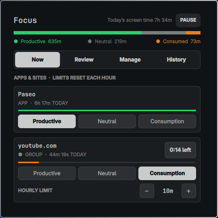
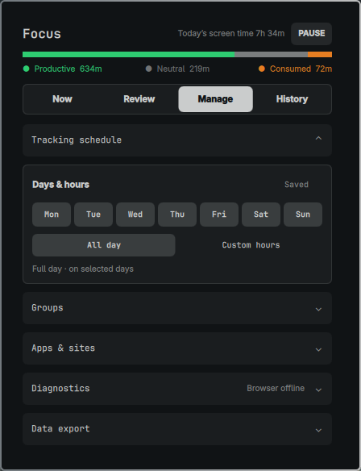

# Focus

Stay focused. Understand your screen time and set limits on distractions.

Track apps and websites, give distracting services an hourly budget, and review
your week. Built for Omarchy Linux. Your activity stays on your computer.






## Install

Requires Omarchy Linux, Python 3, libpsl and a systemd user session. The helper is required;
installing the widget alone does not start tracking.

```sh
git clone https://github.com/NoFlairos/focus.git
cd focus
./scripts/install-local.sh

plugin_dir="${XDG_CONFIG_HOME:-$HOME/.config}/omarchy/plugins/io.github.noflairos.focus-ratio"
mkdir -p "$plugin_dir"
install -m 0644 manifest.json BarWidget.qml Panel.qml "$plugin_dir/"
omarchy plugin enable io.github.noflairos.focus-ratio
omarchy restart shell
```

The helper installer registers the Chrome Web Store extension for Chromium and
Google Chrome automatically. Store publication is pending.

For websites during development, load `~/.local/share/focus-ratio/browser` in `chrome://extensions`
with Developer mode enabled. Copy its ID, then run:

```sh
./scripts/install-browser-host.sh EXTENSION_ID
```

Restart Chromium or Google Chrome. The extension popup should show **Connected**.
Without the extension, the browser is tracked as one desktop app.
Paths follow your XDG settings when configured.

## Use

- **Now:** visible apps and sites. **Review:** classify or exclude new entries.
- **Manage:** schedule, groups, quotas, warnings, diagnostics and exports.
- **History:** the last seven days. **Pause:** stop tracking and limit enforcement.

Defaults: weekdays 08:00–17:00, 10 minutes/hour for Consumption. Limits reset
at each clock hour. The default limit action **closes the window or active tab**;
choose Notify or Keep open in Manage if preferred.

Screen time counts simultaneous activity once. Per-app totals can therefore
exceed screen time. Tracking stops while paused, idle, locked or outside the schedule.
Mapped windows can count even when covered; background tabs do not count, and
ambiguous browser titles are skipped.

Groups share settings and one counter. Merging adds existing history, which cannot
be split afterward. Detach starts an independent counter with the same settings.
Explicit web-app domains link automatically. Domains has three modes:

- **Smart:** automatically group sites with the same declared application or manifest.
- **Group:** automatically join all sites in the displayed domain family.
- **Separate:** keep new sites independent; existing groups remain linked.

Domain families use system libpsl ICANN data, so Group can also join hosted
projects such as `*.pages.dev`. Detached, excluded and dismissed entries stay
independent. Other matching services remain suggestions.

Classified entries can be excluded without losing their settings or history.
Excluding an unclassified entry deletes its pending history. Track again restores
the entry immediately, joining its group or returning it to Review.
Excluded entries are hidden by default. Show / Hide remembers your choice;
individual Hide and Show hidden control entries separately.
Use **↑ / ↓** to jump through long lists.

## Data and removal

Data stays on this computer. [Privacy and deletion](PRIVACY.md) ·
[Public privacy policy](https://noflairos.github.io/focus/privacy.html)

```sh
omarchy plugin disable io.github.noflairos.focus-ratio
./scripts/uninstall-local.sh
```

Remove the widget directory created above if no longer needed. Settings and
history are retained. Data export provides CSV history and JSON settings backups;
clearing history also resets current limits but keeps settings and exported files.
To restore settings, stop `focus-ratio.service`, replace
`~/.config/focus-ratio/config.json` with the backup, then restart the service.

## Development

```sh
./scripts/check.sh                   # Python, Node.js, QtTest and Omarchy
./scripts/check-isolated.sh          # also requires bubblewrap and Chromium
python3 scripts/build-release.py     # local archives in dist/
```

[Validation](release/VALIDATION.md) · [Publication files](release/README.md) ·
[Support](https://github.com/NoFlairos/focus/issues)

Public name: Focus. Technical IDs and data paths retain `focus-ratio` for compatibility.
